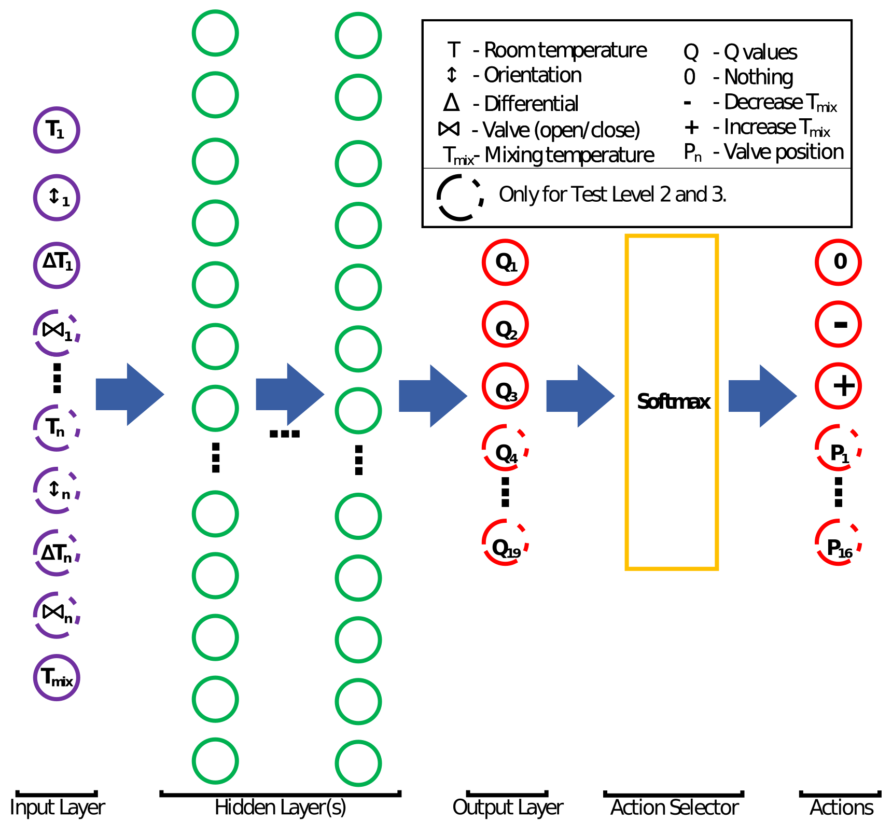
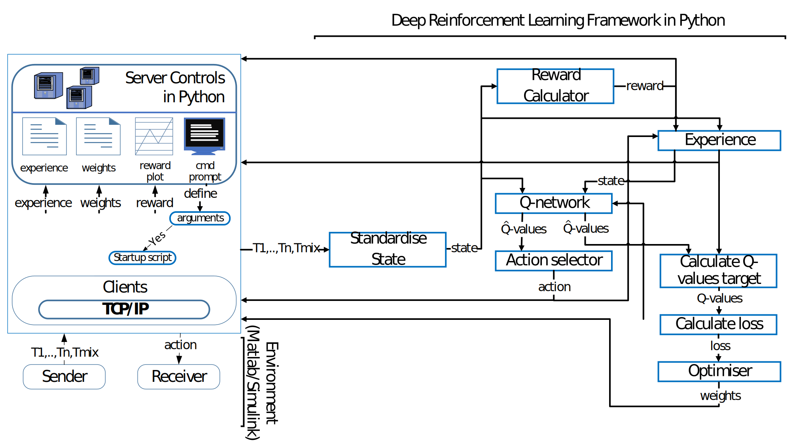

# AI for Underfloor Heating Systems

There are several different heating and cooling system to accommodate clime control in
houses, one of those are the underfloor heating system. The underfloor heating system is
as the name suggest a heating system that heat the floors in a house. The floors are heated
by hot water flowing through hoses within the floor, and the temperature of the room is
controlled by on/off valves controlling the flow through the hoses.
These underfloor heating systems have slow dynamics due to the fact that the heat must
be transferred from the water to the floor, and from the floor to the room. It can be
feasible to design controllers for larger buildings so that it can compensate for the slow
dynamics, and thereby reduce oscillating room temperatures. To design these controllers,
an extensive knowledge about the building is required. It is therefore not feasible to
design these controllers for every normal household due to every household have unique
dynamic properties and locations. A normal household uses threshold controllers with a
hysteria control. This can result in oscillating room temperatures. Furthermore, are the
room temperatures often only controlled by the flow and not by both the flow and the
temperature water flowing through the hoses.

The benefit of using reinforcement learning would be that extensive knowledge about the
building would not be needed, because the idea is that the controller would learn the ideal
behaviour to avoid oscillating room temperatures. Furthermore will reinforcement learning
also be a control platform where it will be possible to add multiple inputs such as weather
information, sunlight etc. and customise the controller to the client.

## Table of Contents
- [Project](#project)
- [Installation](#installation)
- [How To Run](#how-to-run)
- [Team](#team)
- [License](#license)

## Project
The AI called a agent controls a underfloor heating system where room(s) depending on environment
needs where a reference room temperature is 22&deg;C. The agent is rewarded by getting closer to the reference
room temperature, being close to reference room temperature and having a low mixing temperature meaning here is
lower usage of energy.

### Environment
The function of a underfloor heating system is to heat a number of zones to their given reference temperature. A
diagram of a conventional underfloor heating system is shown in Figure 1.

  

<i>Figure 1. - Diagram of a four circuit conventional underfloor heating system illustrating four main components</a></i>

Water from a heat source and return water is mixed in the mixing unit to temperature which is pumped through a pump to a number of circuits.
A balancing valve controls the static resistance and is preset due to big circuits requires higher flow to the a room. The on/off valve is
in a conventional control system "on" when a temperature is below the reference temperature and "off" when above the reference temperature.

The agent will minimum have the ability to control the temperature of the water flowing out of the mixing unit and maximum have the ability 
to control the mixing unit and the on/off valves depending on the test level. These test levels are specified in [How To Run](#how-to-run)
under the subsection "Environments:"

### AI
From the command prompt the user can specify which environment he/she wants to control, size of hidden layer(s) and other parameter variables
specified in [How To Run](#how-to-run). Architecture of the Q-network is shown in Figure 2.

  

<i>Figure 2. - Architecture of Q-network.</a></i>

Starting from the input layer it can be seen that room temperature T, orientation,
differential \Delta, valve (open/close) and mixing temperature Tmix is used depending on the
test level. All inputs are standardised before inputting them to the q-network to insure faster convergence.
Test Level 1 and 2 only control Tmix and therefore do not have any valve information nor
multiple room temperatures, orientation, and differential as indicated in the black box top
right in Figure 2. Test Level 1 and 2 therefore have four inputs, Test Level 3 has nine
inputs and Test Level 4 has 17 inputs to the hidden layer(s).

The chose to have reinforcement learning with Q-network because it is not feasible to store every state action value
Q seperately in a Q-table with a large number of state-action pairs which were the traditional method. Instead we just update update and store
our weights in one Q-network. The chose three different algoritms using Deep Q-networks with experience replay.
The first is a Deep Q-Network denoted DQN, second a DQN with a LSTM (Long Short-Term Memory) layer denoted DQN+LSTM and third a DQN with eligibility
trace denoted DQN+ET. The LSTM layer was chosen due to its capability to detect whether a value (temperature) is decreasing or 
increasing since the last time step due to its recurrent capability. The idea behind the choice of choosing eligibility trace 
is that the agent will be able to make a series of actions for n time steps and then evaluate and reward whether these set of actions were the best.
This capability with eligibility trace is good because we are dealing with a system with a slow response (approximately 6 hours) meaning that from
when we try to heat the room then there will go 6 hours until it can be detected because we are dealing with underfloor heating systems with slow thermo dynamics.

### Architecture
All interaction internally and externally regarding the environment (client), server
(Python) and the deep reinforcement learning framework in Python is shown Figure 3.

  

<i>Figure 3. - All communication between layer and internally (Inspiration from [hvass](https://www.youtube.com/watch?v=Vz5l886eptw&t=1397s).</a></i>

Here it can be seen that that the environment transmit environment of relevant temperatures through a TCP/IP 
connection to the server in Python. The server transmit the environment data to the DRL framework in Python which 
returns an action from the action selector to the environment.

### Test
Many test have been conducted but in Figure 4. Test 3 is shown for Test Level 4 where the environment "SHTL4" is used.
This simulation environment consist of a four circuit house environment with dynamic properties of a house with four different rooms(climate zones)

  

<i>Figure 4. - Left figure displays Simulink data and figure on the right displays training curves tracking the agent score for Test 3 on Test Level 4 with Deep Q-network with Eligibility Trace in PyTorch.</a></i>

In the end Test 3 for Test Level 4 shown in Figure 4. satisfied our requirements for our run. The requirements is that room temperature(s) is allowed a 
standard deviation of 1 from a given reference temperature which is 22&deg;C in this test, Test 4 for Test Level 4. Test results for Test 3 and all three test run 
is shown in Table 1.

  

<i>Table 1. - Calculated mean and standard deviation from results from Test Level 4 tests with Deep Q-network with Eligibility Trace in PyTorch. Elements are grey coloured 
elements if room temperature satisfied requirements. Mean and standard deviation is calculated from the period 7*10^7 107 to 8*10^7 seconds.</a></i>

## Installation
### For AI
* Python v3.5
* PyTorch v0.3.1 on CPU
* TensorFlow v0.12 on CPU
* Numpy
* Matplotlib

pytorch can be installed by using < `conda install -c peterjc123 pytorch` > with anaconda

tensorflow for windows can be installed by using < `pip install tensorflow` > or < `pip install https://storage.googleapis.com/tensorflow/windows/cpu/tensorflow-0.12.0rc0-cp35-cp35m-win_amd64.whl` >

### For Simulation Models for House Environments
* Matlab R2017b
* Simulink 

### Clone
Clone this repo to your local machine using `git clone https://github.com/qLience/AI-Pump-for-Underfloor-Heating-systems`

## How To Run

### Optional arguments:  
    -swe    -- (Start Weights and Experience) - Name of Weights to start with, from saves/weigts')
    -ewe    -- (End Weights and Experience) - Name of Weights which is saved in saves/weights and name of brain plot which is saved in saves/plots (default is <default_name>)')
    -ers    -- (experience replay sample size) - how much to sample when learning, Note: only for tf_dqnet (160 is default)')
    -erb    -- (experience replaybatch size) - how much to use when learning (default 300)')
    -erc    -- (experience replay capacity) - size of experience replay memory (default 100000)')
    -lr'    -- (Learning rate) - (0.001 is default')
    -gamma  -- (Discount factor) - (0.9 is default')
    -tau    -- (Temperature) - For Softmax function, note: when choosing torch_dqnet tau should be 1-10 (50 is default')
    -es     -- (Epsilon start) - For epsilon Greedy start value, meaning random action is taken 90%% of the time (0.9 is default)')
    -ee     -- (Epsilon end) - For epsilon Greedy end value, meaning random action is taken 5%% of the time after decay(0.05 is default)')
    -ed     -- (Epsilon decay) - For epsilon Greedy, by default decay from 0.9 to 0.1 over 2000 steps (2000 is default')
    -acs    -- (action selector) - (softmax is default) Note: epsilon greedy is not made for eligibility trace', choices=[SOFTMAX, EPS])
    -en     -- (eligibility trace steps n) - How many steps should eligiblity trace take (1 is default, is simple one step Q learning)')
    -hn     -- (hidden neurons) - For Q-network (60 is default for hidden layers')
    -hl     -- (hidden layer(s)) - For Q-network (1 is default)', choices=[ONE, TWO])
    -t1     -- Reference temperature in circuit 1 regarding reward policy, go to simulink model if another reference temperature is rewarding regarding speed control (default 22)')
    -t2     -- Reference temperature in circuit 2 regarding reward policy, go to simulink model if another reference temperature is rewarding regarding speed control (default 22)')
    -t3     -- Reference temperature in circuit 3 regarding reward policy, go to simulink model if another reference temperature is rewarding regarding speed control (default 22)')
    -t4     -- Reference temperature in circuit 4 regarding reward policy, go to simulink model if another reference temperature is rewarding regarding speed control (default 22)')
    -lm     -- (Learning Mode) - Q-network will be updated if active (Learning mode is active by default)', choices=[NO])
    -startup--This set Tmix to wanted and all valves if there is any and stops flow to circuits when reference temperatures is met before proceeding with DRL algorithm (No, not active by default)', choices=[YES])
    -Tmix   -- Start mixing temperature is required when using start up')
    -model  -- Model type - DQN is with tensorflow and DQN LSTM is pytorch and DQNELI is with tensorflow (DQN is default)', choices=[DQN, DQNLSTM, DQNELI])  
  
### Required arguments:  
    -model  -- 'torch_dqn, torch_dqnlstm, torch_dqnet is in pytorch and tf_dqnet is in tensorflow (dqn = deep q-network, eli = eligibility_trace)', choices=[TORCH_DQN, TORCH_DQNLSTM, TORCH_DQNET, TF_DQNET], required=True)
    -env    -- 'S=Simulation, E=Experiment, T=Test, L=Level, N=level grade, TL for normal house and everything with E is regarding experimental setup ', choices=[TL12, TL3, TL4, SETL2, SETL3, SETL4, ETL2, ETL3, ETL4], required=True)

    Note startup requires Tmix which have to be above 20
    
### Environments:
All simulink models of these environments can be found in `/Simulink_Models`.
#### House Environment
These environments is based on charistica of a normal house.
* SHTL1 - Simulation environment of a one circuit house environment without dynamic properties of a house
* SHTL2 - Simulation environment of a one circuit house environment with dynamic properties of a house (Dynamic properties of Circuit 1)
* SHTL3 - Simulation environment of a two circuit house environment with dynamic properties of a house (Dynamic properties of Circuit 1 and 2)
* SHTL4 - Simulation environment of a four circuit house environment with dynamic properties of a house (Dynamic properties of Circuit 1, 2, 3 and 4)

#### Experimental Setup of House
These environment is based on a parameter estimation of a experimental setup.
* SETL2 - Simulation environment of a one circuit experimental setup environment with dynamic properties of a experimental setup (Circuit 3)
* SETL3 - Simulation environment of a two circuit experimental setup environment with dynamic properties of a experimental setup (Circuit 3 and 4)
* SETL4 - Simulation environment of a four circuit experimental setup environment with dynamic properties of a experimental setup (Circuit 1,2,3 and 4) (Not available  yet!)
    
### Example:   
   
Below the user specific specifies the user wants tau = 20, and model should be DQN from pytorch with simulation environment model from Test Level 3 of house environment. 

Running source code:
`python main.py -tau 20 -model torch_dqn -env setl3`

TCP connect receiver and send port by running Simulink model <XXTLX_TestLevel_X_MODEL.slx>. (notice first time starting Simulation can result in 
no connection to TCP/IP server established by python due to duration of building model in Simulink, Simply just run the script again and start the simulation again.

## Team
This project were executed at Aalborg University.

* [Carsten Skovmose Kallesøe](https://www.linkedin.com/in/carsten-skovmose-kalles%C3%B8e-97b5865/) - Control Engineer & Industry Professor
* [Christian Blad](https://www.linkedin.com/in/christian-blad-98b18b119/) - Ph.D in Control Engineering
* [Sajuran Ganeswarathas](https://www.linkedin.com/in/sganes94/) - Manufacturing Engineer
* [Simon Bøgh](https://www.linkedin.com/in/roboticsdk/) - Associate Professor in Robotics
* [Søren Koch](https://www.linkedin.com/in/skoch91/) - Manufacturing Engineer

## License
The content of this project itself is licensed under the [Creative Commons Attribution 3.0 Unported license](https://creativecommons.org/licenses/by/3.0/), and the underlying source code used to format and display that content is licensed under the [MIT license](LICENSE.md).